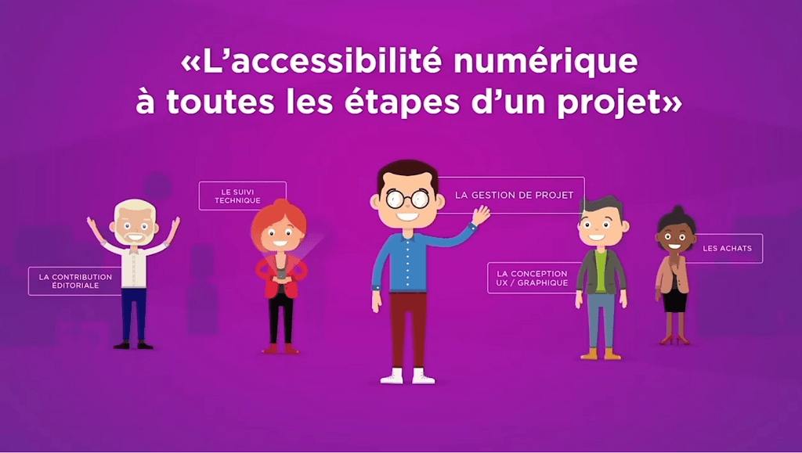

# 01 - Accessibilité numérique

## Qu'est-ce que l'accessibilité numérique ?

L'accessibilité numérique désigne la façon dont des utilisateurs, avec ou sans handicap, peuvent interagir avec les outils technologiques comme que les ordinateurs, les téléphones portables, les tablettes et les **sites Web**.

Concernant un site Web, il s'agit donc de proposer un contenu destiné à être lu (=&nbsp;accessible) à toute personne le visitant, y compris ceux qui ont des limitations d'ordre **physique**, **visuelle**, **auditive** ou **cognitive**.

En règle générale, se concentrer sur l'accessibilité d'un site est bénéfique à tous, mais pour ces personnes, il s'agit d'une **nécessité absolue**. En effet, il est parfois difficile pour eux de naviguer sur un site Web, de lire un contenu hiérarchisé, ou de remplir un formulaire.

Il faut savoir qu'en France, les services numériques des administrations doivent être accessibles à tous (article 47 de la loi du 11 février 2005). Et depuis 2019, le décret de l'accessibilité impose cette obligation à certains acteurs du secteur privé, comme les grosses entreprises.

> #### L'accessibilité numérique à toutes les étapes d'un projet
> 
> 🔻 Regarder la vidéo (Durée : 2m38)
> 
> <a href="https://www.youtube.com/watch?v=e9dgLfpcE9M" target="_blank">
>   
> </a>
> 
> Une vidéo de [la société Atalan sur YouTube](https://www.youtube.com/@societeatalan)

---

## Quels types de handicaps ?

Il existe plusieurs types de handicaps :

- Handicaps **visuels** :
  _Personnes aveugles ou malvoyantes_
- Handicaps **auditifs** :
  _Personnes sourdes ou malentendantes_
- Handicaps **moteurs** :
  _Personnes ne pouvant pas utiliser un clavier ou une souris_
- Handicaps **cognitifs** :
  _Personnes ayants des troubles d'apprentissage, de la mémoire ou de la concentration_
- Handicaps **« occasionnels »** :
  _Personnes ayant des problèmes à la suite d'un accident ou d'une maladie_

> #### Comment les aveugles utilisent internet ?
> 
> 🔻 Regarder la vidéo (Durée : 3m21)
> 
> <a href="https://www.youtube.com/watch?v=DePdWynmd_Y" target="_blank">
>   
> </a>
> 
> Une vidéo de [l'Obs sur YouTube](https://www.youtube.com/@societeatalan)

## Quelles normes définissent l'accessibilité d'un site web ?

L'accessibilité d'un site web est définie par des normes internationales :

- [**WCAG**](https://www.w3.org/WAI/WCAG21/quickref/?showtechniques=111/) (Web Content Accessibility Guidelines)

Ce sont des normes **internationales** éditées par la WAI (Web Accessibility Initiative) pour l'accessibilité du contenu web.

- [**RGAA**](https://accessibilite.numerique.gouv.fr/methode/criteres-et-tests) (Référentiel Général d'Amélioration de l'Accessibilité)

Il s'agit d'un référentiel au niveau **national (France)** permettant de savoir à quel niveau l'on se situe par rapport aux WCAG. Une conformité RGAA permet de respecter les critères de la norme internationale WCAG 2.1

## Les principes d'accessibilité Web

L'accessibilité Web est un domaine très vaste et il existe plusieurs normes et directives qui décrivent les meilleures pratiques en matière d'accessibilité Web. 

Cependant, il existe **6 principes d'accessibilité Web** qui sont généralement considérés comme les principes de base de l'accessibilité Web.

1. **Pouvoir** : Le contenu et les fonctionnalités doivent être disponibles pour tous les utilisateurs, y compris les utilisateurs qui utilisent des navigateurs et des appareils différents, les utilisateurs qui ont des limitations cognitives ou physiques, les utilisateurs qui utilisent des navigateurs d'écran ou des lecteurs d'écran, etc.

2. **Compréhension** : Les utilisateurs doivent pouvoir comprendre le contenu et les fonctionnalités du site Web, y compris les informations contextuelles. Par exemple, les utilisateurs doivent pouvoir comprendre les instructions et les messages d'erreur.

3. **Prévisibilité** : Les utilisateurs doivent pouvoir anticiper la manière dont le contenu et les fonctionnalités vont réagir à leurs actions.

4. **Réactivité** : Les utilisateurs doivent pouvoir contrôler le contenu et les fonctionnalités du site Web.

5. **Sécurité** : Les utilisateurs doivent pouvoir utiliser le contenu et les fonctionnalités du site Web de manière sûre.

6. **Équité** : Les utilisateurs doivent avoir accès à la même information et aux mêmes fonctionnalités, sans discrimination.

## Bonnes pratiques

Les sites Web accessibles sont plus faciles à utiliser pour tous les utilisateurs, y compris ceux qui n'ont pas de handicap.

Techniquement parlant, cela peut passer par la mise en place des éléments suivants :

- **Utiliser des éléments HTML appropriés** tels que les balises sémantiques structurantes (dont nous parlerons plus tard) qui aident les utilisateurs à naviguer sur le site, à comprendre la structure du contenu et à accéder à des informations spécifiques.

- **Décrire les images** d'un site Web pour les utilisateurs qui ne peuvent pas les voir.

- Utiliser des **couleurs contrastées** pour que les utilisateurs puissent facilement lire le contenu. Généralement, on recommande d'utiliser une couleur de fond claire avec du texte foncé ou un fond foncée avec du texte clair.

- Créer des **formulaires accessibles** en utilisant des "labels", des champs de formulaire de taille appropriée, des états de focus clairement visibles et des instructions claires.

- Proposer des vidéos avec **sous-titres** qui expliquent le contenu de la vidéo. 

- Tester l'accessibilité en utilisant des outils d'audit d'accessibilité en ligne ou des lecteurs d'écran ([JAWS](https://www.ceciaa.com/jaws) 🦈 ou [ORCA](https://help.gnome.org/users/orca/stable/index.html.fr) 🐋). Les tests réguliers vous permettront de vous assurer que votre site Web est facilement accessible à tous les utilisateurs.
