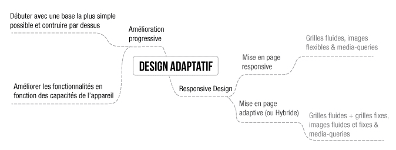
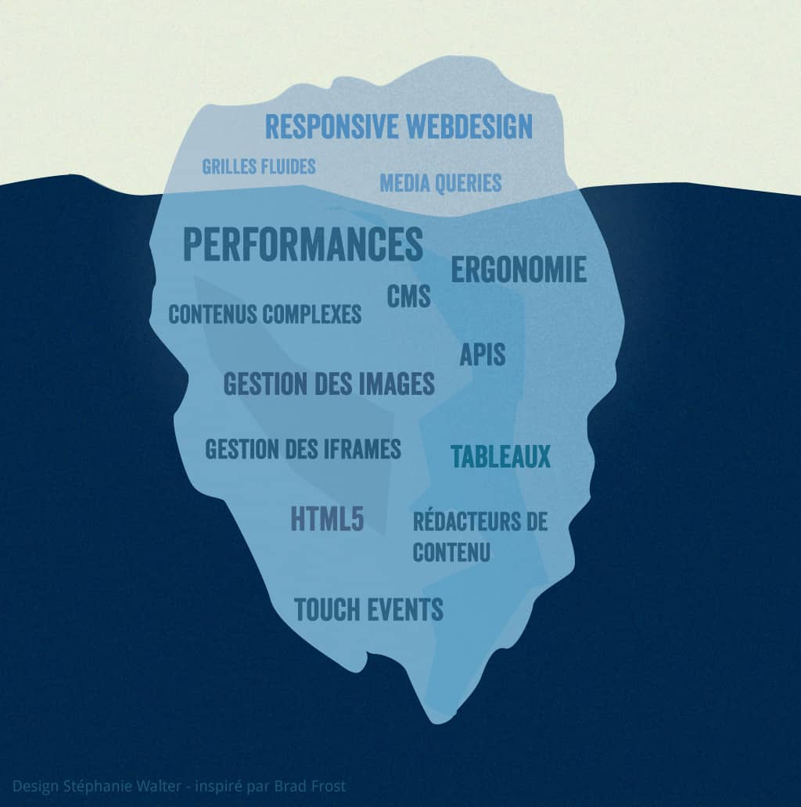
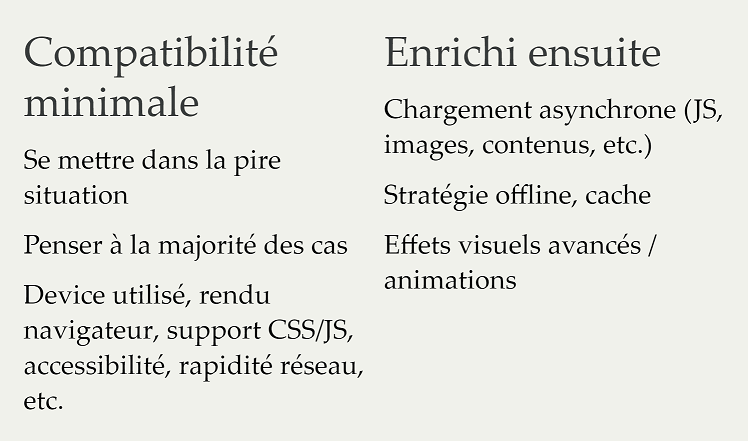

# 02 - Responsive Web Design

## Les principes du RWD

C'est un sous-ensemble du concept d'adaptative webdesign, qui vise à adapter le contenu et la présentation d'un site web à l'appareil utilisé pour le consulter.

Le Responsive Web Design (RWD) est une **approche de conception de sites web** qui vise à **proposer une expérience optimale** quel que soit le **support** utilisé pour le consulter.

- **Responsive** : Qui concerne la _mise en page_ : (images flexibles, grilles fluides, media queries)
- **Adaptative** : Qui concerne l'_UX design_ : apporter la meilleure expérience utilisateur à la plus large audience possible

<p align="center">
  
</p>

> _Image tirée de l'article [Responsive Web Design vs. Adaptive Web Design](https://www.uxpin.com/studio/blog/responsive-web-design-vs-adaptive-web-design/)_ par [Stéphanie Walter](https://stephaniewalter.design/)

<p align="center">
  <a href="https://stephaniewalter.design/fr/blog/responsive-iceberg-illustration/" target="_blank"></a>
</p>

Généralement aujourd'hui, quand on parle de RWD, on désigne en fait à la fois la mise en page et l'experience utilisateur (adaptative).

Cette expérience utilisateur peut être améliorée par l'utilisation de **l'amélioration progressive**.

## Amélioration progressive

L'amélioration progressive (« Progressive Enhancement » en Anglais) est un Concept d'accessibilité et de sémantique, visant à séparer le contenu et la présentation.

Il vise à proposer une interface Web fonctionnelle très simple, et à ajouter des fonctionnalités et des améliorations progressivement, en fonction des capacités du navigateur et de l'appareil utilisé.

<p align="center">
  
</p>

Par exemple, on peut choisir de proposer des fonctionnalités d'ergonomie supplémentaires aux navigateurs qui le supportent, comme l'utilisation des _media queries_.
Les anciens navigateurs qui ne supportent pas les _media queries_ n'auront pas accès à ces fonctionnalités, mais ils auront quand même accès à une interface fonctionnelle.

Cela fonctionne aussi avec les APIs JavaScript modernes, pour lesquels on peut utiliser des polyfills.

Le site [polyfill.io](https://polyfill.io/) permet de générer des polyfills pour pouvoir utiliser les APIs JavaScript modernes dans les anciens navigateurs qui ne les supportent pas.

Par exemple, si on souhaite pouvoir utiliser l'API d'internationalisation [Intl](https://developer.mozilla.org/fr/docs/Web/JavaScript/Reference/Global_Objects/Intl) en ciblant un navigateur ancien comme Internet Explorer 11, on peut inclure le polyfill suivant dans sa page web :

```html
<script src="https://polyfill.io/v3/polyfill.js?features=Intl"></script>
```

- Pour un navigateur récent, cette URL ne génère pas de polyfill, et le navigateur utilisera directement l'API native.

- Pour un navigateur ancien, cette URL génère un polyfill qui permet d'utiliser l'API native si elle est disponible, et sinon de simuler l'API avec des fonctions prédéfinies.

Pour plus de détails sur le concept d'amélioration progressive, voir l'article [Progressive Enhancement](https://developer.mozilla.org/fr/docs/Apprendre/Progressive_Enhancement) sur MDN et [Amélioration progressive](https://fr.wikipedia.org/wiki/Am%C3%A9lioration_progressive) sur Wikipédia.

---

Ressources supplémentaires utiles :

- [Responsive Webdesign – présent et futur de l’adaptation mobile](https://www.alsacreations.com/article/lire/1559-responsive-web-design-present-futur-adaptation-mobile.html), par [Stéphanie Walter](https://stephaniewalter.design/)

- [C'est quoi le RWD ?](https://www.alsacreations.com/article/lire/1615-cest-quoi-le-responsive-web-design.html), par [Raphael Goetter](https://goetter.fr/)