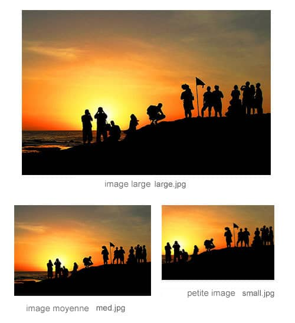
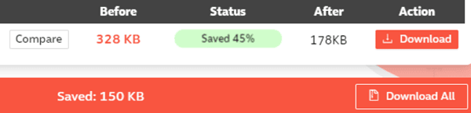
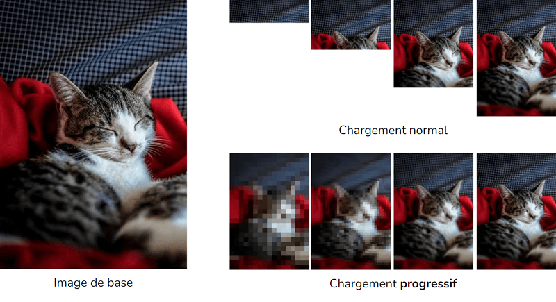
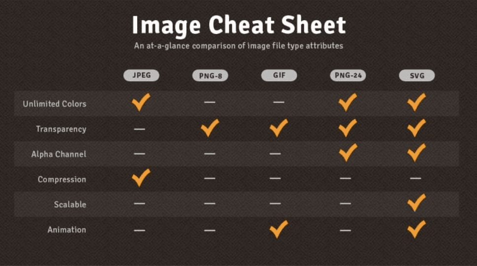
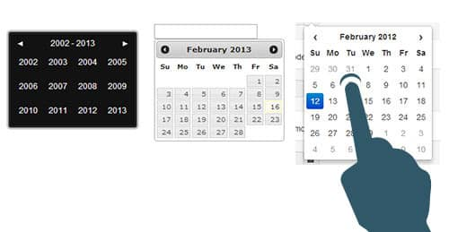
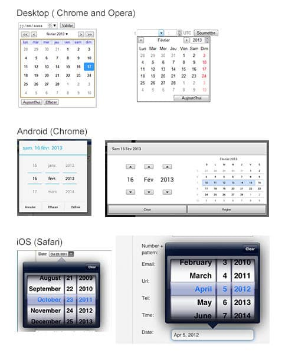
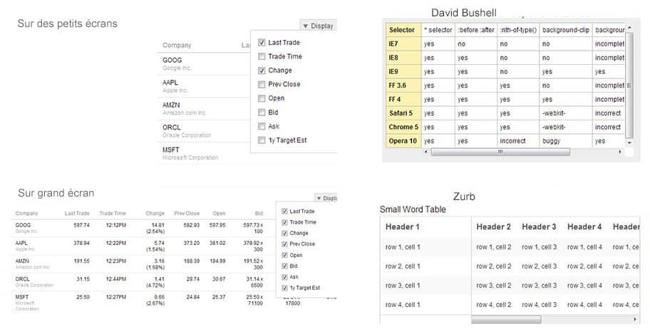
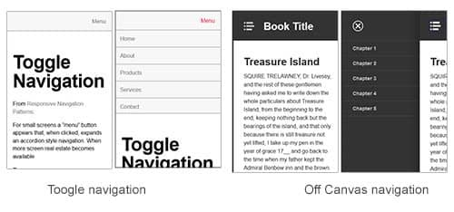
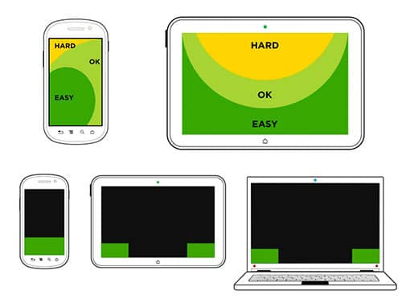
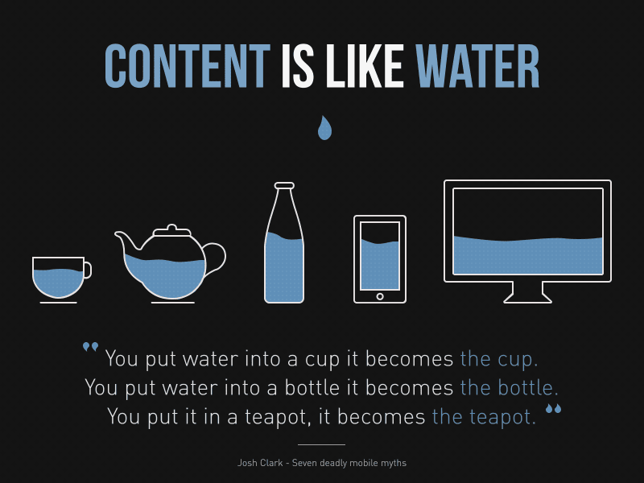

# 03 - Adaptation mobile

## Mobile-first

L'approche Mobile-First est une approche de conception et de développement qui consiste à concevoir et développer d'abord pour les petits écrans, puis à ajouter des fonctionnalités pour les écrans plus grands.

C'est une approche qui s'est imposée dans le développement web, et qui est devenue une norme.

Aujourd'hui, il est devenu incontournable de concevoir et développer des sites web responsive, c'est-à-dire qui s'adaptent à tous les écrans.

Mais s'adapter à un écran ne signifie pas simplement redimensionner les éléments d'une page web et faire en sorte que cela rentre. Il faut aussi prendre en compte les contraintes suivantes :

- 🖥️ contraintes d'affichage (taille de l'écran, densité de pixels, orientation, …)
- 🚣‍♀️ contraintes de navigation (gestes, taille des doigts, …)	
- ⌨️ contraintes de saisie (clavier, tactile)
- ♿ contraintes d'accessibilité (malvoyants, daltoniens, …)
- 🚀 contraintes de performance (connexion, batterie, …)

## Les images : taille vs performance

Aujourd'hui, gérer des images adaptatives est un enjeu majeur pour les développeurs Web. En effet, les images représentent une part importante du poids d'une page web, et donc de son temps de chargement.

On devrait donc logiquement se poser les bonnes questions pour obtenir le meilleur rapport qualité/poids.
	
Est-il pertinant de charger une grosse image sur un petit écran ? Est-ce que l'image va s'afficher avec la bonne résolution ? Est-ce que le format choisi est le meilleur ? Est-ce que l'image est compressée au maximum sans perte de qualité ?

  

### Optimiser les images

L'optimisation des images consiste à produire des images de haute qualité dans le format, les dimensions, la taille et la résolution appropriés en réduisant la taille de l'image sans abîmer sa qualité

C'est l'une des principales techniques pour réduire le temps de chargement des pages d'un site.

De plus, des médias plus légers occupent moins de place sur le serveur (= coûts de stockage amoindri)

  

Le site [Compressor.io](https://compressor.io/) permet de compresser des images en ligne et de les télécharger en plusieurs formats.

### Les formats d'images

Tous les formats d'images ne proposent pas les mêmes avantages. Il faut donc choisir le format le plus adapté à la situation.

#### JPEG

(Joint Photographic Experts Group)

Le format JPEG est le format d'image le plus utilisé sur le web.

Il permet d'obtenir de bons rendus sur les photographies et permet **l'affichage progressif**.

  

#### GIF

Prononçé [ ʒif ]

(Graphics Interchange Format)

C'est un format de compression sans pertes, limité à 256 couleurs 8 bits (transparence pleine possible), et indexation sur une palette RVB.

Il est connu et encore largement utilisé grâce à son support des animations, mais cela alourdit considérablement le poids du fichier.

Il est optimal pour de petits fichiers et/ou avec peu de couleurs (e.g. icônes)

#### PNG

(Portable Network Graphics)

Il s'agit d'un format ouvert de compression sans pertes, proposant de la transparence alpha channel via une palette RVB de 24 bits. Il est généralement optimal pour les images simples avec aplats de couleurs

Il a été créé à la base pour remplacer le format GIF.

### SVG

(Scalable Vector Graphics)

Il s'agit d'un format de données ASCII, basé sur la syntaxe XML (ce qui en fait un format extrêmement léger), et permettant de décrire des ensembles de graphiques vectoriels.

Il a l'avantage de pouvoir être changé en taille et en échelle sans perte de qualité puisqu'il s'agit de vecteurs et non de pixels. Il est donc idéal pour les logos, les icônes, les illustrations, etc. En revanche, il ne permet que de décrire des formes, tracés, lignes et non des photographies.

Il peut aussi être animé.

### WebP

Le format WebP est un format d'image numérique développé par Google en 2010. Il est conçu pour remplacer le format JPEG et le format PNG.

Il permet de réduire le poids des images tout en conservant une qualité équivalente.

#### AVIF

Le format AVIF est un format d'image numérique développé en 2018 par la Motion Picture Experts Group (MPEG) et la World Wide Web Consortium (W3C) pour remplacer le format JPEG et le format PNG.

Il dispose des mêmes avantages que le format WebP, et offre notamment une meilleure compression des images avec des couleurs.

Cependant, le [support de ce format reste encore limité](https://caniuse.com/?search=avif).

---

  

  Source : <a href="https://mytekrescue.com/infographic-image-file-types-decoded">[INFOGRAPHIC] IMAGE FILE TYPES DECODED</a>, de <a href="https://mytekrescue.com/">tekRESCUE</a>

---

## Gérer les éléments d'interface "complexes"

Si gérer un paragraphe de texte est relativement simple, gérer des éléments d'interface complexes comme des boutons, des formulaires, des menus, etc. est plus complexe suivant leur nature.

Par exemple, si un widget de sélection de date sur un formulaire est très pratique sur les périphériques dôtés d'un grand écran et d'un pointeur, sa navigation est plus complexe sur un périphérique tactile.

  

Les nouveaux types de champs HTML5 permettent de gérer plus facilement ces contraintes d'affichage et de saisie sur les périphériques mobiles.

  

On peut aussi se poser la question de la gestion d'autres éléments comme les tableaux de données sur de petits écrans :

  

Doit-on utiliser des cases à cocher ou opter pour un système de tableau scrollable ? La réponse diffère selon les cas.

De la même manière, comment gérer les systèmes de menus et sous-menus sur les périphériques mobiles ? Menu vertical ou horizontal (off-canvas) ? Menu à onglets ?

  

En plus de ces questions, il faut aussi tenir compte des zones d'accès des différents périphériques tactiles :

  

  Source : <a href="https://www.lukew.com/ff/entry.asp?1649">Responsive Navigation: Optimizing for Touch Across Devices</a>, de <a href="https://www.lukew.com/">Luke Wroblewski</a>

Quelques sites proposent des démonstrations et expérimentations de différents types de patterns et modules pour le responsive web design :

- http://bradfrost.github.io/this-is-responsive/patterns.html
- https://navnav.co

## Conclusion

Le responsive web design est un sujet complexe qui nécessite une bonne connaissance des différents types de périphériques et de leurs contraintes d'affichage et de saisie.

Il faut aussi se poser les bonnes questions et choisir les bonnes solutions pour chaque cas.

  
  

## Note 

Ce chapitre est grandement inspiré de l'article de 2013 de [Stéphanie Walter](https://stephaniewalter.design/) sur [Alsacréations](https://www.alsacreations.com/) :

- [Responsive Web Design : présent et futur de l’adaptation mobile](https://www.alsacreations.com/article/lire/1559-responsive-web-design-present-futur-adaptation-mobile.html).

Il est recommandé de le lire en entier pour approfondir le sujet.