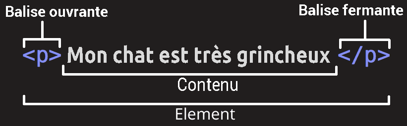
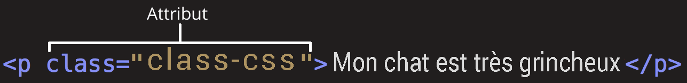
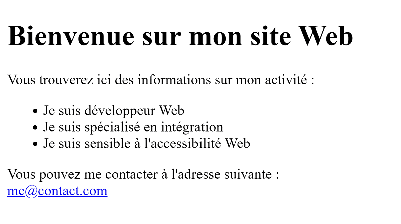
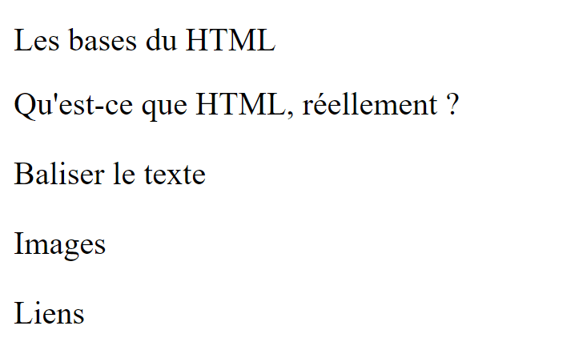

# 01 - Bases et fondamentaux

## Rappels HTML

> <details>
  > <summary>HTML est un acronyme. Pouvez-vous trouver lequel ?</summary>
  >
  > **HyperText Markup Language**
  > 
> </details>

Il est utilisé afin de créer et de représenter le contenu d'une page web et sa structure.

> **Warning**
> HTML n'est pas un langage de programmation mais un langage de **balisage**, c'est-à-dire qu'il est composé de balises (en Anglais : **« tag »** ), permettant de délimiter des zones de contenu.

Une balise s'écrit entre les caractères `<` et `>`

> <details>
  > <summary>Savez-vous comment s'appellent ces caractères ? Et en Anglais ?</summary>
  >
  > Des **chevrons** (en Anglais **« angle bracket »**)
  > 
> </details>

On distingue trois types de balises :

  - **Ouvrantes** : `<balise>`, qui marquent le début d'une zone de contenu.
  - **Fermantes** : `</balise>`, qui marquent la fin d'une zone de contenu.
  - **Auto-fermantes** : `<balise />`, qui marquent l'emplacement d'un élement de contenu (par exemple une image ou une zone de texte intéractive).

> 
> 
> 
> Source : [Les bases du HTML](https://developer.mozilla.org/fr/docs/Learn/Getting_started_with_the_web/HTML_basics) (MDN)

Les balises peuvent contenir des **attributs**. Un attribut est une information complémentaire qui permet de préciser le comportement de la balise.

On écrit les attributs à l'intérieur des chevrons de la balise, sous la forme de paires `nom="valeur"` :

> 
> 
> 
> Source : [Les bases du HTML](https://developer.mozilla.org/fr/docs/Learn/Getting_started_with_the_web/HTML_basics) (MDN)

Les balises sont utilisées pour envelopper les diverses parties du contenu pour les faire apparaître ou agir d'une certaine façon. En fonction de leur nature, elles seront rendues par le navigateur en un mot, une image, un lien hypertexte, un bouton, une zone d'intéraction dynamique … etc.

Par exemple, lorsqu'on écrit le HTML suivant …

```html
<h1>Bienvenue sur mon site Web</h1>

<p>Vous trouverez ici des informations sur mon activité :</p>

<ul>
  <li>Je suis développeur Web</li>
  <li>Je suis spécialisé en intégration</li>
  <li>Je suis sensible à l'accessibilité Web</li>
</ul>

<p>
  Vous pouvez me contacter à l'adresse suivante :<br />
  <a href="mailto:me@contact.com">me@contact.com</a>
</p>
```

… on indique au navigateur que :

- le titre de la page est un titre de niveau 1
- le texte qui suit est un simple paragraphe textuel
- le texte qui suit est une liste non ordonnée, composée de trois éléments de liste
- le texte qui suit est un paragraphe textuel, contenant un lien hypertexte vers une adresse e-mail

Le résultat rendu par défaut sera le suivant :



Il est important de noter que HTML ne sert pas à définir le style visuel du contenu (c'est le rôle du CSS) mais plutôt **la signification (sémantique)** de ce dernier.

En effet, considérant le code HTML et CSS suivant :

```html
<h1>Les bases du HTML</h1>

<h2>Qu'est-ce que HTML, réellement ?</h2>

<h3>Baliser le texte</h3>
<h3>Images</h3>
<h3>Liens</h3>
```
```css
h1, h2, h3 {
  font-size: 1rem;
  font-weight: normal;
}
```

Le navigateur va rendre le contenu de cette façon :



L'aspect visuel est modifié par le CSS, mais la signification du contenu reste la même : il s'agit toujours de titres hiérarchiques de niveau 1, 2 et 3.

## Balises structurantes

Les balises structurantes sont utilisées pour définir la structure générale d'une page web. Elles permettent de délimiter les différentes zones de contenu, et de les organiser en sections distinctes.

Une nouvelle fois, elles ont un **rôle sémantique**. Il en existe 8 :

  - `<header>` : zone d'en-tête de la page ou d'une section
  - `<nav>` : zone de navigation
  - `<main>` : zone principale de contenu
  - `<section>` : zone de contenu générique
  - `<article>` : zone de contenu autonome
  - `<aside>` : zone de contenu secondaire
  - `<footer>` : zone de pied de page
  - `<menu>` : zone de menu

(Voir l'article d'Alsacréations : [Les balises structurantes HTML5](https://www.alsacreations.com/article/lire/1641-balises-structurantes-html5.html) pour plus de détails)

## Balises moins utilisées, et pourtant très utiles

### `<mark>`

https://developer.mozilla.org/fr/docs/Web/HTML/Element/mark#exemple_interactif

La balise `<mark>` représente un texte marqué ou surligné à cause de sa pertinence dans le contexte. Il peut par exemple être utilisé afin d'indiquer les correspondances d'un mot-clé recherché au sein d'un document.

Exemple :

```html
<p>Search results for "salamander":</p>

<hr>

<p>
  Several species of <mark>salamander</mark>
  inhabit the temperate rainforest of
  the Pacific Northwest.
</p>

<p>
  Most <mark>salamander</mark>s are nocturnal,
  and hunt for insects, worms,
  and other small creatures.
</p>
```

---

### `<time>`

https://developer.mozilla.org/fr/docs/Web/HTML/Element/time

Permet de représenter une heure, une date du calendrier grégorien ou une durée valide. Cet élément permet d'utiliser l'attribut `datetime` afin de traduire la date ou l'instant dans un format informatique (permettant aux moteurs de recherche d'exploiter ces données ou de créer des rappels).

```html
<p>
  The Cure will be celebrating their 40th anniversary
  on <time datetime="2018-07-07">July 7</time>
  in London's Hyde Park.
</p>

<p>
  The concert starts at <time datetime="20:00">20:00</time>
  and you'll be able to enjoy the band for at least
  <time datetime="PT2H30M">2h 30m</time>.
</p>
```

---

### `<output>`

https://developer.mozilla.org/fr/docs/Web/HTML/Element/output

L'élément HTML `<output>` représente un conteneur dans lequel un site ou une application peut injecter le résultat d'un calcul ou d'une action utilisateur.

```html
<form oninput="result.value=parseInt(a.value)+parseInt(b.value)">
  <input type="range" name="b" value="50" /> +
  <input type="number" name="a" value="10" /> =
  <output name="result">60</output>
</form>
```

---

### `<cite>`

https://developer.mozilla.org/fr/docs/Web/HTML/Element/cite

L'élément `<cite>` peut faire **référence à** une œuvre telle qu'un livre, une chanson, un film, une sculpture… Cette **référence** peut-être abrégée en accord avec les conventions d'usages pour l'ajout des métadonnées de citations.

```html
<p>
  Une citation de Maître Yoda dans
  <cite><a href="https://www.starwars.com/">Star Wars</a></cite> :
</p>

<blockquote>Do. Or do not. There is no try.</blockquote>
```

---

### `<dfn>`

https://developer.mozilla.org/fr/docs/Web/HTML/Element/dfn

L'élément HTML `<dfn>` (aussi nommé « définition ») est utilisé pour **indiquer le terme défini dans le contexte d'une expression ou d'une phrase de définition**. L'élément `<p>`, le couple `<dt>/<dd>` ou l'élément `<section>` qui est le plus proche ancêtre de `<dfn>` est considéré comme la définition du terme.

```html
<p>
  <dfn>HTML</dfn> is the standard markup language
  for creating web pages.
</p>
```

---

### `<abbr>`

https://developer.mozilla.org/fr/docs/Web/HTML/Element/abbr

L'élément HTML `<abbr>` (abréviation en français) représente une abréviation ou un acronyme ; l'attribut facultatif `title` peut fournir une explication ou une description de l'abréviation. S'il est présent, `title` doit contenir cette description complète et rien d'autre.

```html
<p>
  You can use <abbr title="Cascading Style Sheets">CSS</abbr> to
  style your <abbr title="HyperText Markup Language">HTML</abbr>.

  Using style sheets, you can keep your <abbr>CSS</abbr> presentation
  layer and <abbr>HTML</abbr> content layer separate.

  This is called "separation of concerns."
</p>
```

---

### `<address>`

https://developer.mozilla.org/fr/docs/Web/HTML/Element/address

L'élément HTML `<address>` indique des informations de contact pour une personne, un groupe de personnes ou une organisation.

```html
<p>Contact the author of this page:</p>

<address>
  <a href="mailto:jim@rock.com">jim@rock.com</a><br>
  <a href="tel:+13115552368">(311) 555-2368</a>
</address>
```

---

### `<bdi>`

https://developer.mozilla.org/fr/docs/Web/HTML/Element/bdi

L'élément `<bdi>` (ou élément d'isolation de texte bidirectionnel) isole une portée de texte pouvant être formatée dans une direction différente de celle du texte qui l'entoure.

Un texte bidirectionnel est un texte qui contient à la fois des suites de caractères à lire de gauche à droite (LTR en anglais pour left-to-right) et des suites de caractères à lire de droite à gauche (RTL en anglais pour right-to-left), par exemple une citation en Arabe dans un texte en Anglais.

```html
<h1>World wrestling championships</h1>

<ul>
  <li><bdi>Evil Steven</bdi>: 1st place</li>
  <li><bdi>François fatale</bdi>: 2nd place</li>
  <li><span>تیز سمی</span>: 3rd place</li>
  <li><bdi>الرجل القوي إيان</bdi>: 4th place</li>
  <li><span dir="auto">تیز سمی</span>: 5th place</li>
</ul>
```

---

### `<figure>` et `<figcaption>`

https://developer.mozilla.org/fr/docs/Web/HTML/Element/figure 

L'élément HTML `<figure>` représente un contenu autonome (image, un graphique, un schéma, une illustration, une photo, un code, un tableau, …), éventuellement accompagné d'une légende facultative, qui est spécifiée à l'aide de l'élément `<figcaption>`.

La figure, sa légende et son contenu sont référencés comme une seule unité.

```html
<figure>
  
  <figcaption>An elephant at sunset</figcaption>
</figure>
```

---

### `<details>` et `<summary>`

https://developer.mozilla.org/fr/docs/Web/HTML/Element/details

L'élément HTML `<details>` est utilisé comme un outil permettant de révéler une information. Un résumé ou un intitulé peuvent être fournis grâce à un élément `<summary>`.

```html
<details>
  <summary>Details</summary>
  Something small enough to escape casual notice.
</details>
```

Démonstration intéractive sur Github :

<details>
  <summary>Details</summary>
  Something small enough to escape casual notice.
</details>

---

### `<progress>` et `<meter>`


L'élément HTML `<progress>` indique l'état de complétion d'une tâche et est généralement représenté par une barre de progression.

```html
<label for="file">File progress:</label>

<progress id="file" max="100" value="70"> 70% </progress>
```

https://developer.mozilla.org/fr/docs/Web/HTML/Element/progress

L'élément `<meter>` est un peu différent et permet de définir une jauge. Il représente une valeur scalaire dans un intervalle donné ou une valeur fractionnaire.

```html
<label for="fuel">Fuel level:</label>

<meter id="fuel"
       min="0" max="100"
       low="33" high="66" optimum="80"
       value="50">
    at 50/100
</meter>
```

https://developer.mozilla.org/fr/docs/Web/HTML/Element/meter

---

### `<dialog>`

https://developer.mozilla.org/fr/docs/Web/HTML/Element/dialog

L'élément HTML `<dialog>` représente une boite de dialogue ou un composant interactif (par exemple un inspecteur ou une fenêtre).

```html
<dialog open>
  <p>Salutations, à tous et à toutes !</p>
</dialog>
```

---

### `<datalist>`

https://developer.mozilla.org/fr/docs/Web/HTML/Element/datalist

L'élément HTML `<datalist>` contient un ensemble d'éléments <option> qui représentent les valeurs possibles pour d'autres contrôles.

```html
<label for="ice-cream-choice">Choose a flavor:</label>
<input list="ice-cream-flavors" id="ice-cream-choice">

<datalist id="ice-cream-flavors">
  <option value="Chocolate">
  <option value="Coconut">
  <option value="Mint">
  <option value="Strawberry">
  <option value="Vanilla">
</datalist>
```

---

### `<track>`

https://developer.mozilla.org/fr/docs/Web/HTML/Element/track

L'élément HTML **`<track>`** est utilisé comme élément fils d'un élément `<audio>` ou `<video>` et permet de fournir une piste texte pour le média (par exemple afin de gérer automatiquement les sous-titres).

Les pistes texte utilisées avec cet élément sont formatées selon [le format WebVTT](https://developer.mozilla.org/fr/docs/Web/API/WebVTT_API) (ce sont des fichiers `.vtt`) (WebVTT pour _Web Video Text Tracks_).

```html
<video controls src="/video.mp4">
  <track default kind="captions" srclang="en" src="/subtitles.vtt">
</video>
```
