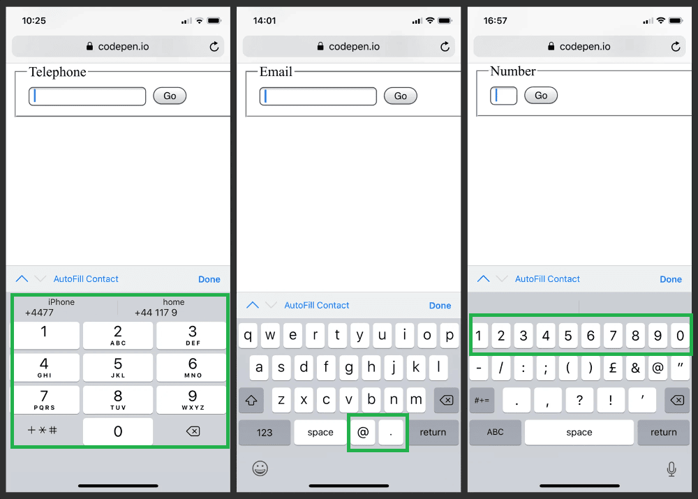
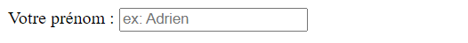
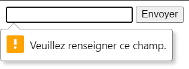
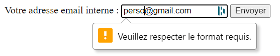

# Formulaires HTML

Les formulaires en HTML sont des éléments qui permettent à l'utilisateur de saisir des données et de les envoyer au serveur. Ils sont composés de champs de saisie, de boutons, de listes déroulantes, de cases à cocher, de boutons radio, etc.

Suivant le type de données à saisir, les formulaires peuvent être très simples ou très complexes. Ils peuvent être utilisés pour des tâches simples comme la recherche sur un site, ou pour des tâches plus complexes comme la réservation d'un billet de train ou d'un hôtel.

De plus, s'agissant d'éléments intéractifs, il se doivent être le plus accessibles possible (via la navigation à la souris, au clavier, sur un écran tacticle, ou via un lecteur d'écran).

Intégrer des formulaires adaptés et accessibles peut parfois être un exercice ardu, mais il est important de le faire pour offrir une expérience utilisateur optimale.

Dans ce chapitre, nous allons voir quels sont les éléments HTML à prioriser et utiliser pour intégrer des formulaires de la façon la plus accessible possible.

Gardez à l'esprit que chaque cas est unique et que vous devrez adapter les éléments HTML utilisés en fonction de vos besoins.

## Les éléments HTML à privilégier

Dans un formulaire, on renseigne généralement des **champs** (« fields » en Anglais).

Afin de faciliter la saisie des données, il est recommandé de décrire les champs avec des **étiquettes** (« labels » en Anglais) :

```html
<label for="prenom">Prénom</label> :
<input type="text" id="prenom" name="prenom">
```

L'attribut `for` du label est en relation directe avec l'attribut `id` du champs qu'il représente. L'attribut `name` lui est utilisé pour définir le nom du champs pour des traitements côté client (JS) ou serveur (ex: PHP).

Lorsqu'un lecteur d'écran lit le code HTML ci-dessus, il va lire le contenu de l'étiquette avant le champ de saisie. Cela permet à l'utilisateur de savoir ce qu'il doit saisir dans le champ, à savoir un prénom : **Le champs de saisie a donc un sens**.

## Nouveaux types de champs HTML5

Depuis HTML5, de nouveaux types de champs ont été ajoutés. Ils permettent de faciliter la saisie des données, sont compatibles avec les appareils mobiles, et sont plus accessibles.

L'élément suivant désigne une zone de texte intéractive simple :

```html
<input type="text">
```

Il est possible d'avoir d'autres types comme :

```html
<input type="password">
<input type="checkbox">
<input type="radio">
<input type="hidden">
<input type="button">
<input type="submit">
<input type="reset">
<input type="file">
```

Depuis HTML5, de nouveaux types sont apparus :

```html
<input type="email">
<input type="tel">
<input type="url">
<input type="number">
<input type="range">
<input type="date">
<input type="month">
<input type="week">
<input type="time">
<input type="datetime-local">
<input type="color">
<input type="search">
```

([Démonstration sur le site du MDN](https://developer.mozilla.org/en-US/docs/Web/HTML/Element/input#input_types))

Ces nouveaux types de champs sont à privilégier car ils sont adaptés à la nature des données à saisir.

Voici des exemples de rendus des types `tel`, `email` et `number` sur un iPhone :

<p align="center">
  
</p>

---

## Les nouveaux attributs de champs HTML5

Les types de champs HTML5 ont été accompagnés de nouveaux attributs qui permettent de faciliter la saisie des données, mais aussi de préciser un état de validation.

### `placeholder`

L'attribut `placeholder` permet de préciser un texte d'information qui sera affiché dans le champs de saisie.

```html
<label for="prenom">Votre prénom :</label>
<input
  type="text"
  id="prenom"
  name="prenom"
  placeholder="ex: Adrien"
>
```

<p align="center">
  
</p>

À noter qu'il est recommandé de **ne pas remettre la même valeur que le label** dans cet attribut, car cela fait double emploi. Un placeholder est généralement utilisé pour donner un exemple de saisie, comme ci-dessus.

### `min`, `max` et `step`

Ces attributs fonctionnent sur les types de champs proposant de saisir des intervalles (ex: `number`, `range`, `date`, `month`, `week`, `time`, `datetime-local`). Ils permettent de préciser les valeurs minimales et maximales, ainsi que la valeur de l'incrément.

```html
<label for="age">Votre âge :</label>
<input type="number" id="age" name="age"
  min="18" max="99" step="1"
>

<label for="heure">Heure de départ :</label>
<input type="time" id="heure" name="heure"
  min="08:00" max="18:00" step="900"
>

<label for="volume">Volume :</label>
<input type="range"
  min="0" max="100" step="10"
>
```

### `required`

L'attribut `required` s'applique à tous les types de champs. Il permet de préciser que le champs est obligatoire.


```html
<form>

  <input
    type="text"
    name="prenom"
    required
  >
  
  <button type="submit">Envoyer</button>
</form>

```

Lorsque l'utilisateur tente de valider le formulaire sans avoir rempli le champs, un message d'erreur est affiché (le style de ce message est défini par le navigateur) :

<p align="center">
  
</p>

### `pattern`

Cet attribut permet de préciser une [expression régulière](https://fr.wikipedia.org/wiki/Expression_r%C3%A9guli%C3%A8re) qui sera utilisée pour valider le champs.

```html
<input
  type="email"
  name="corporate_email"
  pattern="^[\w.%+-]+@company\.com$"
>
```

Le champs ci-dessus ne sera considéré comme valide que si l'utilisateur saisit une adresse email valide et se terminant par `@company.com` :

<p align="center">
  
</p>

Des sites comme [regexr](https://regexr.com/) ou [regex101](https://regex101.com/) peuvent être utiles pour tester des expressions régulières.

### `autocomplete` et `autofocus`

L'attribut `autocomplete` permet de préciser si le champs doit être complété automatiquement par le navigateur. Il peut prendre les valeurs suivantes :

- `on` : le champs est complété automatiquement
- `off` : le champs n'est pas complété automatiquement

```html
<input
  type="text"
  name="prenom"
  autocomplete="off"
>
```

En règle générale, sauf bonne raison, il n'est pas recommandé d'utiliser la valeur `off`.

L'attribut `autofocus` lui, permet de préciser si le champs doit être automatiquement sélectionné lors du chargement de la page.

Il ne peut logiquement être utilisé qu'une seule fois par page.

```html
<input
  type="text"
  name="prenom"
  autocomplete="off"
  autofocus
>
```

Dans ce code, le champs sera automatiquement sélectionné lors du chargement de la page.

Cela peut être pratique par exemple pour une page de connexion où l'utilisateur doit saisir son identifiant et son mot de passe dès son arrivée sur la page.

### `novalidate` et `formnovalidate`

L'attribut `novalidate` permet de désactiver la validation native du formulaire et se place sur l'élément `<form>` lui-même.

L'attribut `formnovalidate` fait la même chose, mais se place sur l'élément `<button>` ou `<input>` qui déclenche la validation du formulaire.

```html
<form novalidate>
  <input type="text" name="prenom" required>
  <button type="submit">Envoyer</button>
</form>

<!--
  Ici, l'attribut "required" est à titre indicatif,
   mais la validation du formulaire est désactivée.

  Dans ce cas, il est recommandé de faire
   la validation avec JavaScript.
-->
```