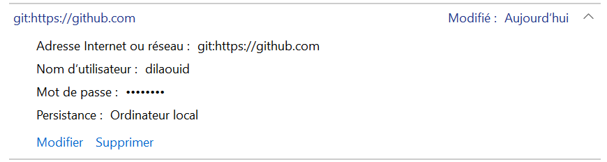

Pour utiliser Git avec des identifiants (credentials), vous pouvez utiliser le gestionnaire de credentials de Git. Voici comment vous pouvez le faire sur Windows, macOS, et Ubuntu:

### 1. Installation de Git:

#### Windows:

1. Téléchargez le programme d'installation de Git depuis le site web officiel: [https://git-scm.com/](https://git-scm.com/)
2. Exécutez le fichier .exe téléchargé et suivez les instructions de l'assistant d'installation.

#### macOS:

1. Si vous avez installé Xcode, Git est déjà installé. Sinon, vous pouvez utiliser Homebrew pour l'installer:
   ```bash
   /bin/bash -c "$(curl -fsSL https://raw.githubusercontent.com/Homebrew/install/HEAD/install.sh)"
   brew install git
   ```

#### Ubuntu:

1. Ouvrez un terminal et exécutez la commande suivante:
   ```bash
   sudo apt update
   sudo apt install git
   ```

### 2. Configuration des Credentials:

#### Windows:

1. Ouvrez une invite de commande ou un terminal Git Bash.
2. Exécutez la commande suivante pour configurer le gestionnaire de credentials:
   ```bash
   git config --global credential.helper wincred
   ```

Le Gestionnaire d'informations d'identification permet d'afficher ou de supprimer les informations d'identification de connexion aux sites Web, aux applications connectées et aux réseaux.

1. Pour ouvrir le Gestionnaire d'informations d'identification, tapez Gestionnaire d’informations d’identification dans la zone de recherche de la barre des tâches, puis sélectionnez panneau Gestionnaire d'informations d'identification.

2. Sélectionnez informations d’identification Web ou informations d’identification Windows pour accéder aux informations d’identification que vous souhaitez gérer.



#### macOS:

1. Ouvrez un terminal.
2. Exécutez la commande suivante pour configurer le gestionnaire de credentials:
   ```bash
   git config --global credential.helper osxkeychain
   ```

#### Ubuntu:

1. Ouvrez un terminal.
2. Pour Ubuntu, vous pouvez utiliser le gestionnaire de credentials `cache` qui mémorise les credentials en mémoire pour une utilisation par des processus git ultérieurs:
   ```bash
   git config --global credential.helper cache
   ```

### 3. Utilisation:

Après avoir configuré le gestionnaire de credentials, lorsque vous accédez à un dépôt Git qui nécessite une authentification, Git vous demandera vos identifiants (nom d'utilisateur et mot de passe). Une fois que vous les avez fournis, le gestionnaire de credentials les mémorisera pour les utilisations futures, donc vous n'aurez pas besoin de les entrer à nouveau pour chaque opération.

### Note:

Assurez-vous que le gestionnaire de credentials est compatible avec la version de votre système d'exploitation et de Git. Vous pouvez trouver plus d'informations sur les gestionnaires de credentials Git dans la documentation officielle de Git: [https://git-scm.com/book/en/v2/Git-Tools-Credential-Storage](https://git-scm.com/book/en/v2/Git-Tools-Credential-Storage).

> **Note**
> 
> En tant qu'étudiant à la 3WA, vous avez accès à GitHub Student Pack !
> Rendez vous sur ce lien : https://education.github.com/discount_requests/application
> Suivez les infos pour demander ses student benefits, renseignez bien votre adresse @3wa.io elle est normalement automatiquement reconnue. 
> Si besoin, vous trouverez votre attestation de scolarité ici : https://3wa.ymag.cloud/index.php/apprenant/documents/
> Vous n'aurez plus qu'a installer l'extention Github Copilot via votre VS Code et synchroniser votre compte github avec.
> Cela ouvre également a tous les bonus github pro, dont l'hébergement via github pages pour vos repo etc. 

> Vous pouvez donc bien entendu, utiliser un GUI pour Git, à savoir, Gitkraken !